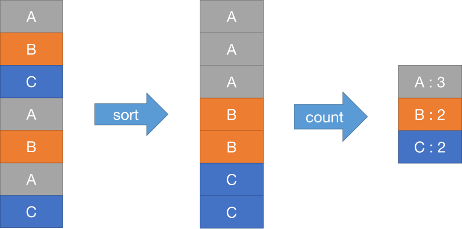

Lab 1要求我们实现一个和MapReduce论文类似的机制，也就是数单词个数Word Count

用于测试的文件在src/main目录下，以pg-*.txt形式命名。每个pg-*.txt文件都是一本电子书，非常长。我们的任务是统计出所有电子书中出现过的单词，以及它们的出现次数。

非分布式实现
这个任务非常简单，如果不写成分布式的，一个实现在src/main/mrsequential.go中。

将所有文章中的单词分出，保存到一个类似数组的结构中。将这些单词排序，从而相同单词在数组中连续地出现在一起。排序完成后，遍历这个数组，由于相同的单词相邻地出现，统计单词个数就很简单了。

